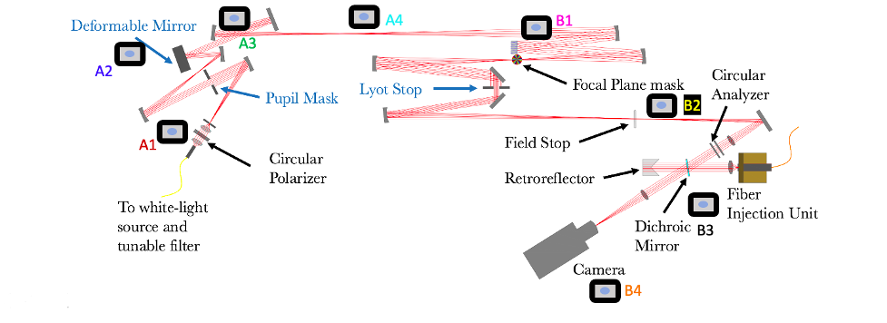
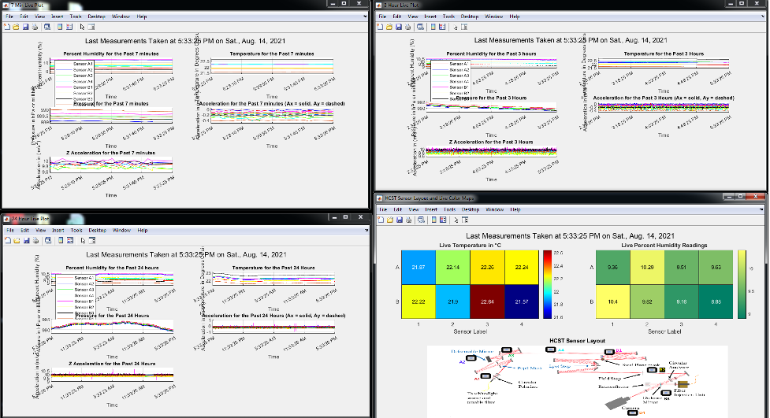
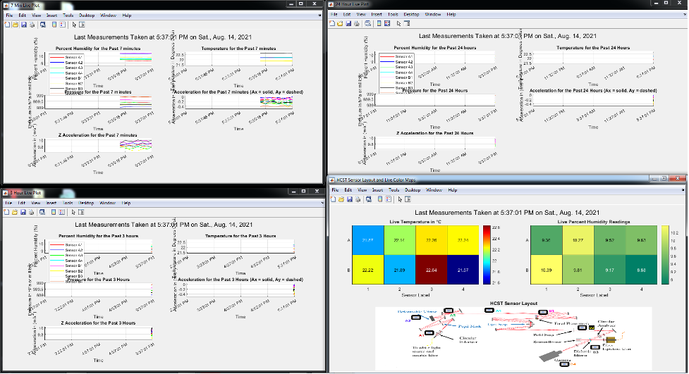
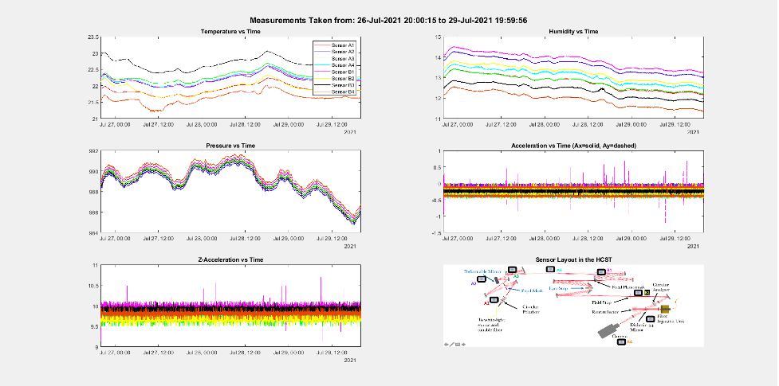

# Caltech-Summer-Project
Documentation for the applications that comprise the environmental sensing system used by the ET lab at HCST

# Documentation for the MATLAB Environmental Sensing Programs

By: Cole Kappel

**Live Plots**
 
**OctoprogramLive.m** – Plots the past 7 minutes, 3 hours and 24 hours of live sensor data from HCST. This program doesn’t save data, it pulls the data from the Arduino which is accessed through the ip address. The program also preallocates data from the past day so the plots will be full when opened as long as the Arduino has been running for 24 hours before opening the programs. If you close any of the figures, the program stops running. For KPIC, you will need to define the IP address used with your computer, for HCST it is 192.168.1.3 (The Arduino website.)
Location of the program at HCST: C:\Users\ET\Documents\OctoprogramLive.m.

**OctoprogramLiveSave.m** – Use this program if for whatever reason something goes wrong with getting the time stamp on the Arduino. No data is preallocated for this program so when you first open it the plots will be empty and they will fill up over time. This program saves the environmental data on the desktop in the EnviSensData folder, where data is written to excel files with a comprehensive naming convention. If you close any of the figures, the program stops running. Note that the program won’t write any data to the excel files while they are opened so make sure to close the excel files quickly after opening them! For KPIC, you will need to define the IP address used with your computer, for HCST it is 192.168.1.3 (The Arduino website.)
Location of the program at HCST: C:\Users\ET\Documents\OctoprogramLiveSave.m.

**Time Check**
 
**OctoprogramTimeCheckFunc.m** – This program defines a function which should be called from the command window. Call it like this: OctoprogramTimeCheckFunc(startYr, startMonth, startDay, startHr, endYr, endMonth, endDay, endHr). The start date must be earlier than the end date. The hour should be entered as a number from 1-24. For example, if you want to look at data from August 1st, 2021 at 5pm to August 4th, 2021 at 3am you would type into the command window: 
OctoprogramTimeCheckFunc(2021, 08, 1, 17, 2021, 08, 4, 3).
If you requested this time span, but august 3rd was missing, then in the command window you would see a statement that this data was not plotted, though the rest of the data will be plotted. If there is an anomaly in the time span that you requested, you will get an error message telling you the time at which the anomaly occurs but the data will still be plotted. 
IMPORTANT: You must be in the documents folder to call this function!! Otherwise it doesn’t work. I would recommend not plotting any data before August 13th, 2021 because the data before this has a lot of anomalies which can make the program not work. For KPIC, you will need to edit the function to define the IP address used with your computer, for HCST it is 192.168.1.3 (The Arduino website.)
Location of the program at HCST: C:\Users\ET\Documents\OctoprogramTimeCheck.m.

**OctoprogramTimeCheck.m** – This program is the same code as OctoprogramTimeCheckFunc.m but it is not a function. Edit lines 19 through 27 to define the start and end times. I would suggest using this program for error testing, but you can also use it if you think it’s easier to use than the function. For KPIC, you will need to define the IP address used with your computer, for HCST it is 192.168.1.3 (The Arduino website.)
Location of the program at HCST: C:\Users\ET\Documents\OctoprogramTimeCheck.m.

**Software**
All programs have been run and tested using MATLAB R2021a.

# Documentation for the Arduino Programs

By: Cole Kappel

**The Main Sketch**

**Metrology_RTC_TimeServer.ino** – This program was first written by Milan in summer 2018, then it was modified by Grady in summer 2019, and finally I modified it in summer, 2021. It is made for environmental sensing at KPIC and at HCST. Right now, people only care about the temperature, humidity and pressure data it acquires, whereas the acceleration data is not accurate enough to be considered.

When you run the program, eight BME680 sensors measure the temperature, humidity and pressure data at the locations that are most sensitive to environmental changes inside the HCST. These sensors measure humidity with 0.008% r.H. resolution, pressure with 0.18Pa resolution and temperature with 0.01◦C resolution. The acceleration noise level is 90mg where 1g=9.8m/s^2. This not precise enough for our application, but in the future, we can hopefully get more precise accelerometers put in the HCST. I didn’t find any that I thought would work for our application that would work with the Arduino hardware.

The environmental sensor data gets uploaded to an IP address and is saved to the SD card on the Arduino. The website/IP address allows you to view all of the saved files on the Arduino. The files with the sensor data are excel files, and they have the format: yyyymmdd.csv where yyyy is the current year, mm is the current month and dd is the current day. You will need to scroll down to the very bottom of the website to view the file for the current day. You can only access the IP address website on the Bernard computer. This is important – the MATLAB programs will only work on the Bernard computer. More precisely, I think that whatever computer the Arduino script is run on is the computer where you will be able to access the IP address and run the MATLAB files, though during my internship I only ever used the Bernard computer, so use that computer to run the Arduino and MATLAB files. 

Right now, the IP address is 192.168.1.3, but if it changes - I’m not sure if it will ever - then you can uncomment the line: #define DEBUG and it will print “server is at <ip address>.” Just make sure to read the comments I left in the sketch that talk about #define DEBUG, because this is important. To view the files that contain the environmental data once you upload the sketch google: 192.168.1.3. This will take you to the “KPIC FIU Environmental Sensing” website.

 I edited the program so that it prints the unix time stamp in the last column on the excel files. This is used with the live environment sensing MATLAB program that I made to preload the previous days data.

This program is a two-in-one program. If you uncomment #define SETTIME, then the sketch’s only purpose is to set the time on the real time clock (RTC) and then display that time in the serial port. If you comment #define SETTIME – only do this once the time is set on the real time clock – the sketch has the original intended function of saving the environmental data to the website. The time is set by a time server in this sketch and you have to define the time zone. Right now, it uses PDT.

I changed the program to use pacific daylight time so that the live MATLAB programs I made show the current local time. At daylight savings time, you don’t necessarily need to switch the time to pacific standard time but if you don’t then just know that you will be getting the time stamp in pacific daylight time.

**The Backup Sketch**

**Metrology_RTC_only.ino** – This program is the same exact program as the program above but it uses a different method to set the time. When you run this sketch, the time is pulled from the computer to set the time so all you have to do is uncomment #define SETTIME to set the time so there’s no need to worry about the time zone. The time will be set to the local time. However, in this sketch the time used to set the RTC is pulled from compilation of the program, which means that if you press the reset button in between uploading the time setting sketch and uploading the sketch with #define SETTIME commented then the time will reset to when the sketch was compiled meaning that the time will most likely be off by 5 or so minutes using this method unless you don’t press the reset button or disconnect the Arduino from power in between uploading the time setting sketch and uploading the data saving sketch. My suggestion is to only use this program if something goes wrong with Metrology_RTC_TimeServer.ino.

Though, if something goes wrong with Metrology_RTC_TimeServer.ino, I would suggest contacting Tobias Schofield if he is around, as he helped me on the time server code in that program. Ask him if he can try to debug Metrology_RTC_TimeServer.ino for you. Tell him it’s the program that Cole helped make for KPIC and that you suspect that the time server went down.

If you do use this program then as fast as possible after uploading the sketch with #define SETTIME uncommented, upload the sketch with #define SETTIME commented. Then google the IP address and make sure the time is very close to the actual time. Again, the RTC time will most likely lag by several minutes depending on how fast you upload the sketch after setting the time using this sketch.

 # Environmental Sensing System Instructions

Upload the Arduino sketch. Make sure the real time clock (RTC) is set to the correct time. See the document titled “Arduino Program Documentation.pdf” for instructions uploading the Arduino sketch.
On the same computer that you uploaded the Arduino sketch - use Bernard at HCST -, run the MATLAB programs. See the document titled “OctoprogramDocumentation.pdf” for instructions using these programs.

**Environmental Sensor Locations at HCST**

 

**Fig. 1** The environmental sensor layout at HCST.

The sensors should be screwed in with plastic screws. If they stop working try surrounding them with non-conducting material/ make sure that they are not touching any conducting metal. Additionally, make sure that the Arduino hardware is not touching any conducting metal. It should be fine inside the plastic box.
 
Output of the MATLAB Programs

 
 
 
**Fig. 2** Output of OctoprogramLive.m. Plots real time data from HCST.

 
 

**Fig. 3** Output of OctoprogramLiveSave.m. The plots will fill up with data over time while saving that data to the desktop on the Bernard computer. This is to be used as a backup program only in case something happens to OctoprogramLive.m.

 
 
**Fig. 4** Output of both OctoprogramTimeCheckFunc.m and OctoprogramTimeCheck.m. The user can check any desired time span of environmental sensor data with these programs.
